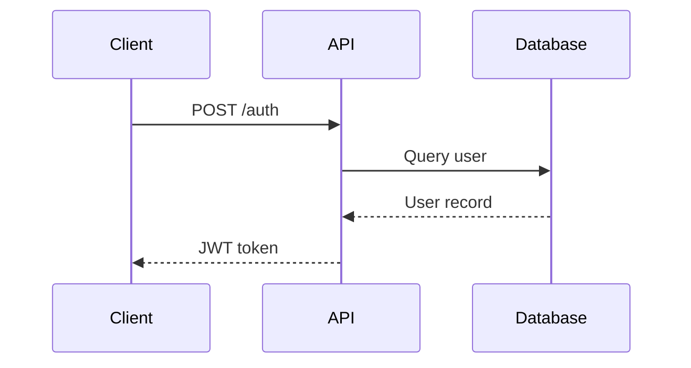

# markdown-mermaid-writing

Write technical docs with diagrams and structured explanations.

## When to use
When writing technical documentation, architecture descriptions, or process explanations that benefit from embedded diagrams.

## Mermaid diagram types
```mermaid
flowchart TD        # process flows
sequenceDiagram     # API call sequences
classDiagram        # object relationships
erDiagram           # database schemas
gantt               # project timelines
stateDiagram-v2     # state machines
```

## Example


## Writing principles
- One diagram per concept. Don't try to show everything in one diagram.
- Label all arrows.
- Use direction TD (top-down) for hierarchies, LR (left-right) for flows.

## Source
Scientific Agent Skills (K-Dense-AI/scientific-agent-skills)
